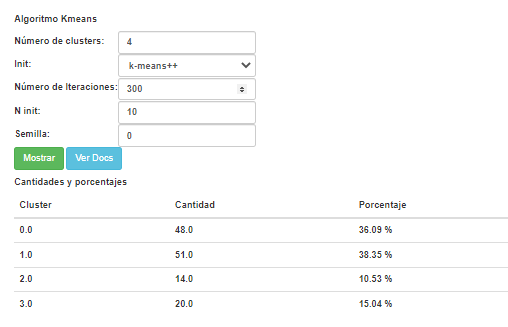
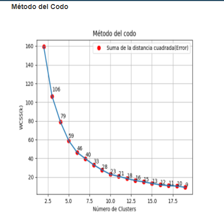
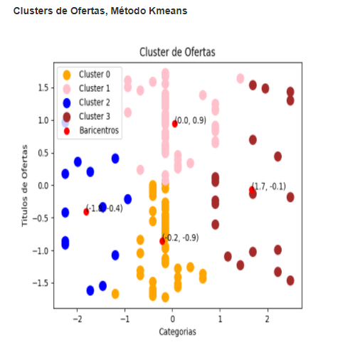

# Team JSJ (Grupo de trabajo)

_Repositorio del grupo TEAM JSJ del curso Taller de construcción de sistemas_

---
## 🚀 Comenzando 🚀

### 📋 Pre-requisitos 

Instalamos las librerias mediante pip
```
pip install requeriments.txt
```

### 🔧 Instalación 

Ejecutar los sprints en un entorno de desarrollo

```
python manage.py runserver
```

---
## ⚙️ Ejecutando las pruebas 
#### Formulario para el algoritmo


#### Grafico de Codo


#### Grafico de los clusters



---
## 🛠️ Construido con 🛠️

* [Python](https://docs.python.org/3/) - Uno de los lenguajes mas usados


---
## ✒️ Autores ✒️

* **Jonny Mejia** - *Trabajo Inicial* - [jonnyMejia](https://github.com/jonnyMejia)
---
